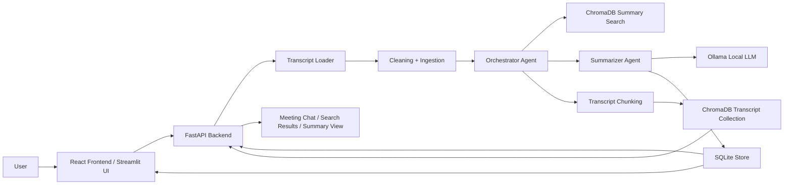
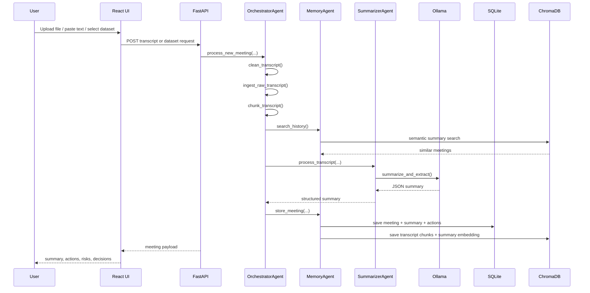
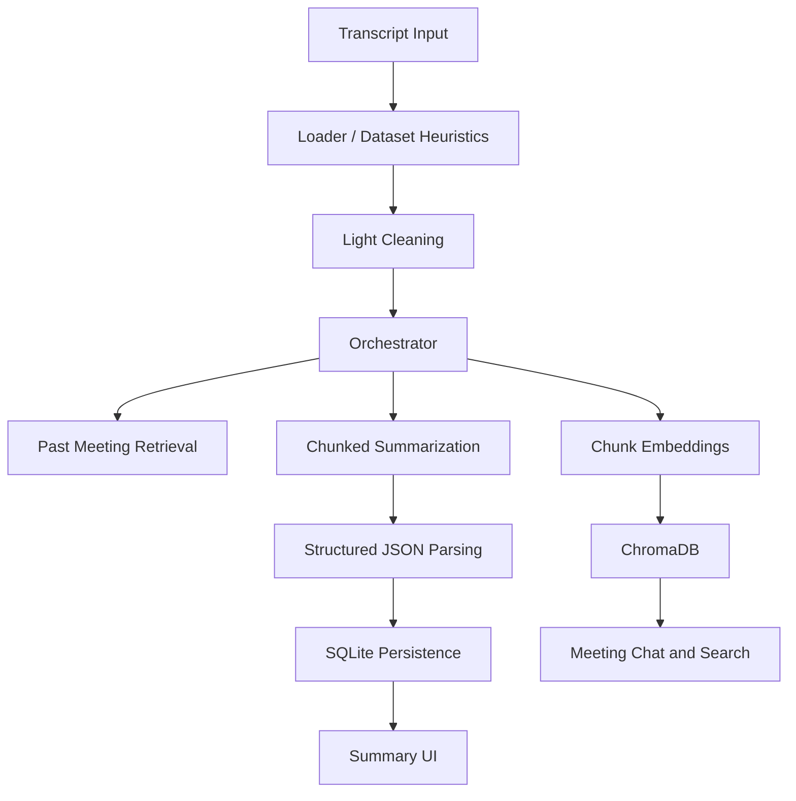

# Meeting Transcript Summarizer

**AI-Powered Smart Meeting Notes, Decisions & Action Item Generator**

Prepared By: [Your Name]  
Organization / College: [Placeholder]  
Date: April 26, 2026  
Version: 1.0  
Status: Production Prototype

---

## Table of Contents

1. [Executive Summary](#1-executive-summary)
2. [Problem Statement](#2-problem-statement)
3. [Project Objectives](#3-project-objectives)
4. [Tech Stack Used](#4-tech-stack-used)
5. [System Approach / Solution Design](#5-system-approach--solution-design)
6. [High Level Design (HLD)](#6-high-level-design-hld)
7. [Low Level Design (LLD)](#7-low-level-design-lld)
8. [Module Breakdown](#8-module-breakdown)
9. [Features Implemented](#9-features-implemented)
10. [Edge Cases Handled](#10-edge-cases-handled)
11. [Challenges Faced & Solutions](#11-challenges-faced--solutions)
12. [Performance Optimizations](#12-performance-optimizations)
13. [Security & Privacy](#13-security--privacy)
14. [API Documentation](#14-api-documentation)
15. [Folder Structure](#15-folder-structure)
16. [Installation & Run Guide](#16-installation--run-guide)
17. [Testing Checklist](#17-testing-checklist)
18. [Future Enhancements](#18-future-enhancements)
19. [Business Impact](#19-business-impact)
20. [Conclusion](#20-conclusion)
21. [Portfolio Extras](#21-portfolio-extras)

---

## 1. Executive Summary

Meeting Transcript Summarizer is a local-first AI application that converts raw meeting transcripts into structured, reusable meeting intelligence. The system accepts pasted text, uploaded documents, and dataset-based transcript samples, then generates an executive summary, key discussion highlights, decisions, risks or blockers, and structured action items.

The project was built to solve a common operational gap in teams: meetings produce valuable decisions and follow-ups, but the raw transcript is too long to review repeatedly, and manual note-taking is inconsistent. This implementation reduces post-meeting effort by turning unstructured conversation into searchable, persistent knowledge.

From a technical standpoint, the project combines local LLM inference through Ollama, semantic retrieval through ChromaDB, structured storage through SQLite, and a dual-interface architecture consisting of a React + FastAPI application with a legacy Streamlit interface. The result is a privacy-oriented production prototype that demonstrates applied AI engineering, retrieval-augmented workflows, dataset ingestion heuristics, and robust post-processing for structured outputs.

---

## 2. Problem Statement

Modern teams spend substantial time in recurring meetings, but the value of those conversations is often lost after the call ends.

Key pain points addressed by this project:

- Long meetings create a heavy review burden for absent participants and future reference.
- Manual note-taking is error-prone and usually misses decisions, deadlines, and ownership.
- Action items are often implied in discussion but never documented formally.
- Teams lack a searchable memory layer across past meetings.
- Raw transcripts are noisy and difficult to convert into operational insight quickly.

In practical settings such as product planning, engineering syncs, HR reviews, and marketing discussions, teams need faster recap systems that capture what happened, what was decided, what is blocked, and who is responsible for the next step.

---

## 3. Project Objectives

The implemented solution targets the following measurable objectives:

- Reduce meeting review time by converting full transcripts into concise summaries.
- Auto-generate executive summaries and discussion highlights from unstructured text.
- Extract explicit and implicit action items in structured form.
- Preserve organizational memory through local persistence and semantic search.
- Support semantic retrieval across prior meetings for continuity and follow-up.
- Enable privacy-first offline AI summarization without cloud API dependency.
- Process both manually uploaded transcripts and row-based transcript datasets.

---

## 4. Tech Stack Used

| Layer | Technology | Purpose |
|---|---|---|
| Frontend | React 19 | Main user interface for upload, search, summary viewing, and meeting chat |
| Frontend Build Tool | Vite 7 | Fast local development server and production build pipeline |
| Frontend UI Icons | lucide-react | Iconography for dashboard actions and navigation |
| Backend API | FastAPI | REST API for status, transcript processing, dataset previewing, storage, search, and chat |
| Backend Server | Uvicorn | ASGI server for running the FastAPI app |
| Legacy UI | Streamlit | Single-process fallback interface that exercises the same service layer |
| LLM Runtime | Ollama | Local model serving for summarization and meeting Q&A |
| Default LLM | `llama3.2` | Default local summarization and chat model |
| Prompting / Validation | Pydantic v2 | Validation and normalization of LLM JSON outputs |
| Embedding Model | `sentence-transformers/all-MiniLM-L6-v2` | Semantic embeddings for transcript chunks and meeting summaries |
| Vector Database | ChromaDB | Persistent semantic storage for transcript retrieval and past meeting search |
| Structured Database | SQLite | Storage for meetings, summaries, and action items |
| Data Processing | pandas | Dataset loading, profiling, transcript reconstruction, and tabular ingestion |
| File Parsing | pypdf, openpyxl, xlrd, pyarrow, fastparquet | PDF, Excel, JSON, CSV, Parquet, and tabular input support |
| Testing | pytest | Unit and behavior verification across pipeline helpers and storage |
| Configuration | Environment variables | Runtime tuning for model name, context size, output length, and transcript size budget |

---

## 5. System Approach / Solution Design

The actual repository implements the following processing flow:

1. **Input acquisition**
   - User can paste transcript text, upload a file, or process a sample from `data/dataset/`.

2. **File validation and extraction**
   - `app/services/transcript_file_loader.py` validates supported formats and extracts text from text, PDF, tabular, and Excel sources.

3. **Transcript cleanup**
   - `app/tools/clean_text.py` normalizes whitespace and strips problematic non-ASCII characters for predictable downstream parsing.

4. **Meeting object creation**
   - `app/tools/ingest_transcript.py` assigns a UUID, current timestamp, title, transcript body, and metadata.

5. **Transcript chunking for retrieval**
   - `app/tools/chunk_text.py` splits transcripts into overlapping word windows for semantic indexing.

6. **Context retrieval from prior meetings**
   - `OrchestratorAgent` performs semantic search over prior summaries to provide continuity context for the current summarization call.

7. **LLM summarization and extraction**
   - `SummarizerAgent` calls `app/tools/summarize_meeting.py`, which uses JSON-constrained prompts from `app/llm/prompts.py`.
   - Large transcripts are split into summarization chunks using a configurable character budget, and chunk results are merged.

8. **Action item normalization**
   - Raw model action items are transformed into structured records with IDs, default status, owner fallback, and deadline fallback.

9. **Persistence**
   - Structured meeting data is stored in SQLite.
   - Transcript chunks and summary text are stored in ChromaDB for later retrieval.

10. **Output rendering and follow-up Q&A**
   - React and Streamlit views render summaries, decisions, risks, and action tables.
   - Meeting-specific chat retrieves relevant transcript chunks and answers user questions using local LLM inference.

---

## 6. High Level Design (HLD)



### HLD Notes

- The application is **local-first** and avoids cloud inference.
- It separates **structured persistence** (SQLite) from **semantic retrieval** (ChromaDB).
- It uses **two retrieval layers**:
  - past meeting summary search for continuity during summarization
  - transcript chunk search for question answering on a selected meeting

---

## 7. Low Level Design (LLD)

### 7.1 Core Folder Responsibilities

| Folder | Responsibility |
|---|---|
| `app/api/` | FastAPI routes and service graph construction |
| `app/agents/` | Orchestration layer for summarization, memory, and chat |
| `app/llm/` | Prompt templates and Ollama integration |
| `app/memory/` | SQLite and ChromaDB persistence |
| `app/services/` | Dataset loading, transcript extraction, evaluation helpers |
| `app/tools/` | Small reusable pipeline functions for cleaning, chunking, summarization, and retrieval |
| `app/schemas/` | Pydantic models for meetings, summaries, and action items |
| `frontend/src/` | React application logic and styles |
| `data/` | Persistent meeting database, vector store, datasets, and sample transcripts |
| `tests/` | Unit tests for tools, stores, schemas, loaders, and orchestrator helpers |

### 7.2 Major Runtime Components

| Component | Actual Role in Code |
|---|---|
| `Services` container | Builds singleton backend dependencies once through `lru_cache` |
| `OrchestratorAgent` | Coordinates cleaning, ingestion, retrieval, summarization, storage, and chat |
| `SummarizerAgent` | Converts a transcript into structured summary output |
| `MemoryAgent` | Owns storage, semantic history search, and transcript context retrieval |
| `OllamaClient` | Centralizes model name, context size, output length, keep-alive, and model availability |
| `DatasetLoader` | Detects transcript dataset shape and reconstructs usable transcript samples |
| `TranscriptFileLoader` | Converts uploaded files into transcript text and metadata |

### 7.3 Internal Sequence Flow



### 7.4 Frontend State Behavior

- `App.jsx` keeps shell-level state for:
  - API/model status
  - available datasets
  - saved meetings
  - selected meeting detail
  - search query and search results
- `SummaryPanel` handles tab switching between summary, decisions, actions, risks, and chat.
- `ChatPanel` manages transient question/answer state per loaded meeting.
- `Sidebar` manages upload, dataset preview, and meeting switching flows.

---

## 8. Module Breakdown

### Frontend Module

- Built as a dashboard-oriented React interface.
- Supports:
  - transcript file upload
  - pasted transcript text
  - dataset preview and processing
  - meeting history browsing
  - semantic search across saved meetings
  - meeting-specific chat
- UI characteristics:
  - sidebar-driven workflow
  - tabbed result view
  - status pill for local model availability
  - action items rendered in table format

### Backend Module

- FastAPI exposes processing, storage, search, and chat endpoints.
- The API layer uses a cached service graph so stores, vector collections, and model client are reused across requests.
- The backend returns frontend-friendly combined meeting + summary payloads.

### AI Module

- Prompt templates are defined centrally in `app/llm/prompts.py`.
- Summarization is JSON-constrained to reduce parsing ambiguity.
- Large transcripts are summarized chunk-by-chunk and merged into a single deduplicated result.
- Chat uses retrieval-augmented answering over transcript chunks.
- Action-item questions are short-circuited directly from SQLite, avoiding unnecessary LLM calls.

### Database Module

- SQLite stores:
  - meetings
  - summaries
  - action items
- ChromaDB stores:
  - transcript chunk embeddings for meeting chat
  - meeting summary embeddings for historical semantic search

### Utility Module

- Dataset heuristics identify transcript columns, meeting grouping columns, speaker columns, title columns, and ordering columns.
- Transcript file loader supports text, PDF, CSV, TSV, JSON, JSONL, NDJSON, Parquet, XLS, and XLSX.
- Evaluation helper measures total processing time for a sample run.

---

## 9. Features Implemented

The following features are actually implemented in the repository:

- Upload transcripts as text, markdown, log, subtitle, PDF, JSON, CSV, TSV, Parquet, and Excel files
- Paste raw transcript text directly into the application
- Preview dataset-derived transcript samples before processing
- Auto-detect multiple dataset shapes and reconstruct transcript text
- Generate executive summaries
- Generate key discussion highlights
- Extract decisions made
- Extract risks and blockers
- Extract structured action items with owner, deadline, and status
- Persist meetings locally in SQLite
- Persist embeddings locally in ChromaDB
- Semantic search across past meetings
- Chat with a selected meeting using transcript retrieval
- Local model availability check via Ollama
- React frontend with FastAPI backend
- Legacy Streamlit UI for single-process usage
- Static serving of the built React app from FastAPI when `frontend/dist` exists

---

## 10. Edge Cases Handled

### 10.1 Implemented Handling in the Current Codebase

| Edge Case | Handling Strategy in Repository | Impact |
|---|---|---|
| Empty transcript text | API rejects blank pasted text with HTTP 400 | Prevents empty summarization runs |
| Empty uploaded file | `TranscriptFileError` raised before processing | Avoids meaningless storage and model calls |
| Unsupported file format | Upload loader rejects unknown extensions | Protects ingestion path from invalid inputs |
| PDF with no selectable text | PDF reader returns friendly error | Prevents silent failures on scanned/non-extractable PDFs |
| Invalid or noisy LLM JSON | Parser strips code fences, extracts first JSON object, validates with Pydantic, and falls back safely | Keeps pipeline resilient to imperfect model output |
| Long transcripts | Summarization splits transcript by character budget and merges chunk summaries | Improves reliability on larger inputs |
| Missing action item fields | Owner defaults to `Unassigned`, deadline defaults to `None`, status defaults to `Pending` | Keeps action data structured and usable |
| Empty / irregular dataset rows | Loader falls back to first non-empty row or returns no sample safely | Prevents preview/process crashes |
| One meeting spread across many dataset rows | Loader reconstructs transcript using grouped or combined row logic | Makes real transcript datasets usable |
| Multiple rows from many meetings in one dataset | Group-column detection samples one meeting at a time | Avoids mixing unrelated conversations |
| Missing speaker labels in datasets | Transcript reconstruction can still proceed without speaker prefixing | Preserves recoverable transcript content |
| LLM unavailable | Status endpoint checks Ollama availability and UI shows offline state | Makes operational dependency visible to user |
| Reprocessing same meeting summary | SQLite deletes prior action items before saving replacements | Prevents stale tasks from lingering |

### 10.2 Edge Cases Discovered During Transcript Cleaning Research

During transcript-cleaning analysis, the following broader set of meeting-specific noise cases was identified:

- Missing or inconsistent speaker labels
- Overlapping or interrupted speech
- Side conversations
- Filler words and verbal tics
- Mis-transcribed words
- Repeated phrases from STT glitches
- Time references without dates
- Retractions and corrections
- Hypotheticals vs decisions
- Implicit action items
- Multiple actions in one sentence
- Soft commitments
- Greetings and closings
- Small talk
- System messages
- Code-switching or mixed languages
- Bullet lists read aloud
- Acronyms and jargon
- Extremely long monologues
- Topic switching without markers
- Speculation presented as fact
- Sensitive information

### 10.3 Why Only 8 Were Kept in `prompt.py`

The repository currently operationalizes **8 high-impact edge cases** directly inside `app/llm/prompts.py`:

1. Speaker normalization  
2. Retractions and corrections  
3. Implicit or unassigned action items  
4. Hypotheticals vs decisions  
5. Relative dates  
6. Filler words and STT noise  
7. Multiple actions in one sentence  
8. Greetings and small talk

**Short rationale:** these eight were chosen because they directly affect summary accuracy, action-item extraction, and decision fidelity in the current pipeline. The broader list was intentionally not hard-coded into the cleaning stage because handling all of them before inference significantly slowed processing. Moving the most valuable eight into the prompt kept the solution fast while still protecting the outputs that matter most to end users.

---

## 11. Challenges Faced & Solutions

### 11.1 Challenge 1: Transcript Cleaning Became Too Slow

Initially, the selected 8 edge cases were being handled during transcript cleaning itself. That approach increased preprocessing overhead and made the end-to-end pipeline noticeably slower.

**Solution:** the project moved those 8 edge-case instructions into `prompt.py`, allowing the LLM to handle them during structured extraction instead of forcing heavier rule-based cleaning upfront.

**Outcome:** preprocessing remained lightweight, while summary and action extraction preserved business-critical reasoning quality.

### 11.2 Challenge 2: Dataset Mode Ambiguity

Transcript datasets do not come in one standard format. Some store a full meeting in one row, some split one meeting across many rows, and some contain many meetings in the same file.

**Solution:** `DatasetLoader` uses heuristics to detect text columns, grouping columns, speaker columns, title columns, ordering columns, and the most appropriate processing mode. It also exposes a profile so the UI can preview what was detected before processing.

**Outcome:** one pipeline can operate across multiple real-world dataset layouts without requiring manual reformatting first.

### 11.3 Challenge 3: Samples from Many Meetings Inside One Dataset

When a dataset contains rows from many different meetings, naive row concatenation can mix unrelated conversations and produce invalid summaries.

**Solution:** the loader detects a grouping column such as `meeting_id`, `meeting_uid`, `conversation_id`, or similar fields, then reconstructs one transcript sample from only the rows belonging to a single selected group.

**Outcome:** each summarization run stays logically bounded to one meeting, which improves summary quality, action-item relevance, and retrieval accuracy.

---

## 12. Performance Optimizations

The repository includes several practical optimizations:

- **Cached service graph**: FastAPI reuses stores and clients through `lru_cache`.
- **Ollama keep-alive**: model sessions are retained for a configurable window.
- **Chunked summarization**: long transcripts are split into manageable chunks.
- **Overlapping retrieval chunks**: transcript chunk overlap improves semantic continuity.
- **Two-store architecture**: SQLite handles structured lookups efficiently while ChromaDB handles semantic search.
- **Parallel shell loading in frontend**: the React app fetches status, dataset list, and meetings together during refresh.
- **Action-item chat shortcut**: action-item questions bypass the LLM and read directly from saved structured data.
- **Result deduplication**: merged chunk summaries deduplicate repeated highlights, decisions, blockers, and actions.

---

## 13. Security & Privacy

This project demonstrates a privacy-conscious architecture:

- All core AI inference is designed to run locally through Ollama.
- No external LLM API keys are required by the current implementation.
- Meeting transcripts are stored in local project data directories.
- File upload handling is restricted to known extensions and validated before processing.
- Invalid input produces controlled exceptions instead of raw trace-heavy responses.
- Configuration values are isolated through environment variables rather than hard-coded runtime constants.

**Important note:** there is no dedicated redaction layer yet for sensitive information. Sensitive-data handling is currently a recognized transcript edge case rather than a completed mitigation feature.

---

## 14. API Documentation

| Method | Endpoint | Purpose | Request | Response |
|---|---|---|---|---|
| `GET` | `/api/status` | Check local model availability | None | Model name and online flag |
| `GET` | `/api/datasets` | List supported dataset files | None | `{ files: [...] }` |
| `POST` | `/api/datasets/preview` | Preview one extracted transcript sample from a dataset | JSON `{ filename, mode? }` | Dataset profile + sample preview |
| `POST` | `/api/datasets/process` | Process one sampled transcript from a dataset and persist it | JSON `{ filename, mode? }` | `meeting_id`, meeting, summary |
| `POST` | `/api/transcripts/text` | Process pasted transcript text | JSON `{ text, title }` | `meeting_id`, meeting, summary |
| `POST` | `/api/transcripts/upload` | Process uploaded file after text extraction | Multipart form with `file`, optional `title` | `meeting_id`, meeting, summary |
| `GET` | `/api/meetings` | List saved meetings | None | `{ meetings: [...] }` |
| `GET` | `/api/meetings/{meeting_id}` | Get one stored meeting and summary | Path parameter | `{ meeting, summary }` |
| `GET` | `/api/search` | Semantic search across saved meetings | Query param `q` | `{ results: [...] }` |
| `POST` | `/api/meetings/{meeting_id}/chat` | Ask a question about one meeting | JSON `{ question }` | `{ answer }` |

### Example Response Shape

```json
{
  "meeting": {
    "id": "uuid",
    "title": "Meeting title",
    "date": "2026-04-26T10:00:00",
    "metadata": {}
  },
  "summary": {
    "meeting_id": "uuid",
    "executive_summary": "string",
    "bullet_highlights": [],
    "decisions": [],
    "risks_blockers": [],
    "action_items": []
  }
}
```

---

## 15. Folder Structure

```text
meeting_notes_summerizer/
|-- app/
|   |-- agents/
|   |   |-- memory_agent.py
|   |   |-- orchestrator_agent.py
|   |   `-- summarizer_agent.py
|   |-- api/
|   |   |-- __init__.py
|   |   `-- server.py
|   |-- llm/
|   |   |-- ollama_client.py
|   |   `-- prompts.py
|   |-- memory/
|   |   |-- sqlite_store.py
|   |   `-- vector_store.py
|   |-- schemas/
|   |   |-- action_item.py
|   |   |-- meeting.py
|   |   `-- summary.py
|   |-- services/
|   |   |-- dataset_loader.py
|   |   |-- evaluation.py
|   |   `-- transcript_file_loader.py
|   `-- tools/
|       |-- chunk_text.py
|       |-- clean_text.py
|       |-- compact_transcript.py
|       |-- extract_actions.py
|       |-- ingest_transcript.py
|       |-- retrieve_context.py
|       |-- save_meeting.py
|       |-- search_meetings.py
|       `-- summarize_meeting.py
|-- data/
|   |-- chroma_db/
|   |-- dataset/
|   |-- meeting_notes.db
|   `-- sample_transcripts/
|-- frontend/
|   |-- dist/
|   |-- src/
|   |   |-- App.jsx
|   |   |-- main.jsx
|   |   `-- styles.css
|   |-- index.html
|   |-- package.json
|   `-- vite.config.js
|-- tests/
|   |-- test_dataset_loader.py
|   |-- test_orchestrator_agent.py
|   |-- test_schemas.py
|   |-- test_sqlite_store.py
|   |-- test_tools.py
|   `-- test_transcript_file_loader.py
|-- debug_llm.py
|-- pyproject.toml
|-- README.md
|-- requirements.txt
`-- streamlit_app.py
```

---

## 16. Installation & Run Guide

### 16.1 Prerequisites

- Python 3.11+
- Node.js and npm
- Ollama installed locally

### 16.2 Backend Setup

```bash
git clone <repository-url>
cd meeting_notes_summerizer
python -m venv .venv
.venv\Scripts\activate
pip install -r requirements.txt
```

### 16.3 Start Ollama

```bash
ollama run llama3.2
```

### 16.4 Run FastAPI Backend

```bash
python -m uvicorn app.api.server:app --host 127.0.0.1 --port 8000
```

### 16.5 Run React Frontend

```bash
cd frontend
npm install
npm run dev
```

Open: `http://127.0.0.1:5173`

### 16.6 Build Frontend and Serve Through FastAPI

```bash
cd frontend
npm run build
cd ..
python -m uvicorn app.api.server:app --host 127.0.0.1 --port 8000
```

Open: `http://127.0.0.1:8000`

### 16.7 Run Legacy Streamlit UI

```bash
streamlit run streamlit_app.py
```

### 16.8 Optional Dataset Placement

Place supported dataset files inside:

```text
data/dataset/
```

---

## 17. Testing Checklist

### Current Verification Status

- Repository test suite result: **30 tests passed**
- Verified through: `.venv\Scripts\python -m pytest -q`

### Functional Checklist

| Test Area | Expected Outcome |
|---|---|
| Upload text transcript | Transcript is processed and summary tabs populate |
| Upload CSV/JSON/Excel/PDF | Loader extracts usable transcript text or returns clear error |
| Pasted transcript processing | Empty text is rejected; valid text creates a meeting record |
| Dataset preview | Dataset profile is shown and sample preview renders |
| Dataset processing | One transcript sample is processed and persisted |
| Summary generation | Executive summary, highlights, decisions, risks, and action items are returned |
| Semantic search | Related past meetings appear for a natural-language query |
| Meeting chat | Relevant transcript chunks are retrieved and used for answer generation |
| Action item chat query | Stored actions are returned directly without LLM dependency |
| Reprocessing storage | Old action items are replaced rather than duplicated |
| UI responsiveness | Sidebar, top bar, tabs, and meeting detail layout remain usable on mobile and desktop |

---

## 18. Future Enhancements

The following roadmap items are realistic extensions of the current architecture:

- Live meeting summarization from streaming transcripts
- Speaker diarization for audio-first meeting input
- Multi-language transcript support and code-switch aware extraction
- Export to email, PDF, or DOCX from the UI
- Calendar and meeting platform integration
- Analytics dashboard for recurring decisions, blockers, and ownership trends
- Role-based access and multi-user workspace support
- Sensitive data masking and policy-driven redaction
- More advanced evaluation metrics for summary quality
- Batch processing for entire transcript datasets

---

## 19. Business Impact

### HR Teams

- Capture interview panels, hiring committee notes, and follow-up actions consistently.

### Product Teams

- Preserve roadmap decisions, open risks, dependencies, and owner assignments across recurring reviews.

### Startups

- Reduce operational overhead by making meeting outcomes searchable without extra tooling cost.

### Enterprises

- Build searchable meeting memory while keeping sensitive content on local infrastructure.

### Students and Academic Teams

- Turn project discussions, faculty reviews, and presentation prep meetings into structured documentation quickly.

---

## 20. Conclusion

Meeting Transcript Summarizer is a practical AI engineering project that combines local LLM inference, retrieval-augmented generation, structured persistence, and flexible transcript ingestion into one coherent product. It addresses a real productivity problem with a grounded implementation rather than a conceptual demo.

The project is especially strong as a portfolio and submission asset because it demonstrates system design, prompt engineering, dataset handling, semantic search, API development, frontend integration, and testing discipline in a single application. With additional polishing around export workflows, streaming input, and privacy controls, the architecture is well-positioned to scale from prototype to a stronger production-grade assistant for meeting intelligence.

---

## 21. Portfolio Extras

### Resume Project Description (3 lines)

Built a local-first AI meeting intelligence platform that summarizes transcripts, extracts decisions and action items, and enables semantic search across past meetings.  
Designed a React + FastAPI architecture with Ollama, ChromaDB, and SQLite for privacy-preserving inference and retrieval.  
Implemented dataset-aware transcript reconstruction, structured LLM prompting, chunked summarization, and meeting-specific chat workflows.

### GitHub README Summary

Meeting Transcript Summarizer is a privacy-first AI application for converting raw meeting transcripts into executive summaries, key highlights, decisions, risks, and structured action items. It runs locally using Ollama, stores structured outputs in SQLite, indexes transcript and summary embeddings in ChromaDB, and provides both semantic meeting search and meeting-specific chat through a React + FastAPI interface.

### Interview Explanation: Explain This Project in 60 Seconds

This project is a local AI meeting assistant that takes transcripts from pasted text, uploaded documents, or datasets and turns them into structured meeting outputs. I built a FastAPI backend and React frontend, used Ollama for local LLM inference, SQLite for structured storage, and ChromaDB for semantic retrieval. The pipeline cleans transcript text, reconstructs datasets into usable conversations, summarizes long meetings in chunks, extracts decisions and action items in JSON, and lets users search or chat with past meetings afterward.

### Recruiter-Friendly Highlights

- Built an end-to-end AI product, not just an isolated model demo
- Implemented local LLM orchestration with structured JSON prompting
- Added semantic retrieval using embeddings and persistent vector storage
- Designed multi-format ingestion for transcripts, PDFs, spreadsheets, and datasets
- Combined backend APIs, frontend UX, storage, testing, and prompt engineering in one project
- Delivered a privacy-first workflow with no required cloud AI dependency

---

## Appendix: Architecture Snapshot


